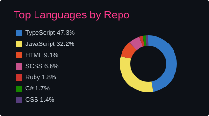
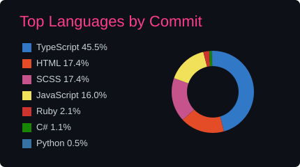

<h1 align="center">Hey there, I'm Adi 👋</h1>

  

## 👨‍💻 About Me

I'm a Computer Science graduate with a strong interest in Web Development, Software Engineering, and Artificial Intelligence. I enjoy building practical applications, exploring new technologies, and continuously improving my skills through hands-on projects.

I'm especially interested in full-stack development and modern web technologies. Recently, I've also started learning Ruby and exploring Ruby on Rails, with the goal of expanding my backend development skills and working with different approaches to building web applications.

- 🌱 Currently learning Ruby and exploring Ruby on Rails
- 🔭 Working on personal software projects
- 💻 Building full-stack web applications
- ⚙️ Working with Angular, Node.js, TypeScript 
- 🤖 Interested in Artificial Intelligence and Reinforcement Learning
- 🎮 Worked on a Reinforcement Learning project using PPO

## 🛠️ Technologies

### Languages

### Frontend

### Backend

### Database

### Tools

---

## 📊 GitHub Stats

  

 

  
  

 

  

---

## 🐍 Contribution Activity

  

---

## 🚀 Featured Interests

- Web Development
- Full-Stack Development
- Ruby & Ruby on Rails
- Artificial Intelligence
- Reinforcement Learning
- Software Engineering

---

## 👀 Profile Views

  
