<h1 align="center">Hey there, I'm Adi 👋</h1>

  

## 👨‍💻 About Me

I'm a Computer Science graduate with a interest in Web Development, Software Engineering, and Artificial Intelligence. I enjoy building practical applications, exploring new technologies, and improving my skills through hands-on projects. I'm especially interested in full-stack development, modern web technologies, and creating efficient and user-friendly software solutions. I also enjoy learning about AI and experimenting with different approaches to solve real-world problems.

- 🔭 Working on personal software projects
- 🌱 Learning Angular, Node.js, TypeScript and Java
- 💻 Building full-stack web applications
- 🤖 Interested in Artificial Intelligence and Reinforcement Learning
- 🎮 Worked on a Reinforcement Learning project using PPO

## 🛠️ Technologies

### Languages

### Frontend

### Backend

### Database

### Tools

---

## 📊 GitHub Stats

---

## 🚀 Featured Interests

- Web Development
- Full-Stack Development
- Artificial Intelligence
- Reinforcement Learning
- Software Engineering

---

## 👀 Profile Views

